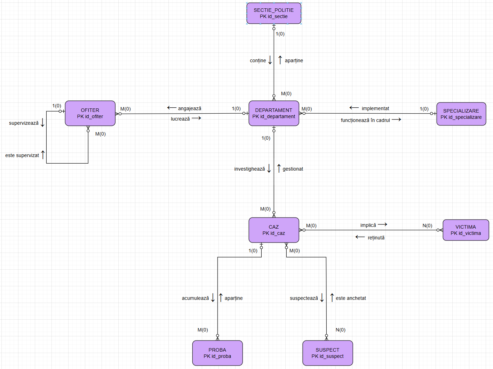
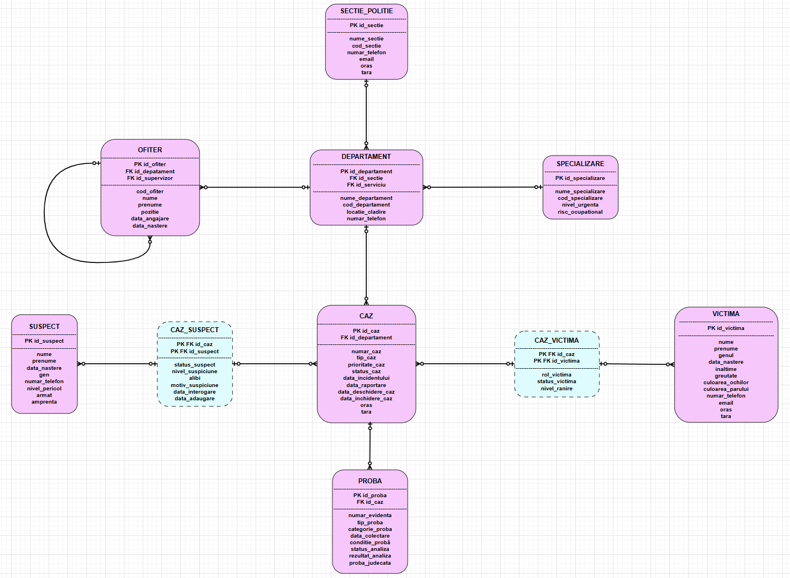

# 📊 SISTEM DE GESTIUNE A SECȚIILOR DE POLIȚIE - BAZĂ DE DATE

## 📋 Cuprins

1. [Descriere Generală](#descriere-generală)
2. [Arhitectura Bazei de Date](#arhitectura-bazei-de-date)
3. [Diagrame](#diagrame)
4. [Schema Bazei de Date](#schema-bazei-de-date)
6. [Instalare și Configurare](#instalare-și-configurare)
7. [Utilizare](#utilizare)
8. [Cerințe Proiect](#cerințe-proiect)
9. [Tehnologii Folosite](#tehnologii-folosite)
10. [Autor](#autor)

---

## 📖 Descriere Generală

Sistemul de Management a Secțiilor de Poliție este o bază de date complexă Oracle 19c concepută pentru gestionarea eficientă a cazurilor criminale, probelor, suspecților și resurselor umane ale unei instituții polițienești moderne.

### 🎯 Obiective Principale

- **Gestionarea cazurilor criminale** - Tracking complet de la raportare la rezolvare
- **Management probe** - Evidență probe fizice, lanț de custodie, rezultate analize
- **Tracking suspecți și victime** - Bază de date centralizată cu relații complexe
- **Optimizare resurse** - Asignare automată cazuri la departamente specializate
- **Audit și securitate** - Trasabilitate completă modificări date și structură
- **Raportare executivă** - Analiză performanță și predictii

---

## 🏗️ Arhitectura Bazei de Date

### Structură Organizațională
```
POLIȚIA ROMÂNĂ
    ├── SECȚII DE POLIȚIE
    │   ├── DEPARTAMENTE (cu specializări)
    │   │   └── OFIȚERI
    │   └── CAZURI
    │       ├── PROBE
    │       ├── SUSPECȚI
    │       └── VICTIME
    └── SPECIALIZĂRI (Omoruri, Furturi, Cyber, etc.)
```

### Entități Principale

**10 Tabele:**
- **8 Tabele Neasociative:** SECTIE_POLITIE, SPECIALIZARE, DEPARTAMENT, OFITER, CAZ, PROBA, SUSPECT, VICTIMA
- **2 Tabele Asociative:** CAZ_SUSPECT, CAZ_VICTIMA

---

## 📊 Diagrame

### Diagramă ER (Entity-Relationship)



*Diagrama ER prezintă relațiile dintre entitățile sistemului și cardinalitățile acestora.*

### Diagramă Conceptuală (Model Relațional)



*Diagrama conceptuală prezintă structura detaliată a tabelelor cu toate atributele, tipurile de date și constrângerile.*
---

## 🗃️ Schema Bazei de Date

**1. SECTIE_POLITIE** - Reprezintă unitățile polițienești la nivel de secție (ex: Secția 1 Poliție București)

**2. SPECIALIZARE** - Tipurile de specializări disponibile (Omoruri - OMO, Furturi - FURT, Cyber - CYB, etc.)

**3. DEPARTAMENT** - Departamente specializate în cadrul secțiilor (ex: Departament Omoruri - Secția 1)

**4. OFITER** -  Ofițerii de poliție alocați departamentelor, cu ierarhie (supervizor)

**5. CAZ** - Cazurile criminale gestionate de sistem

**6. PROBA** - Probele colectate pentru cazuri (ADN, amprentă, documente, etc.)

**7. SUSPECT** - Bază de date suspecți (poate fi partajată între cazuri)

**8. VICTIMA** - Bază de date victime

**9. CAZ_SUSPECT** (Tabelă Asociativă) - Relația Many-to-Many între cazuri și suspecți

**10. CAZ_VICTIMA** (Tabelă Asociativă) - Relația Many-to-Many între cazuri și victime

---

## 🚀 Instalare și Configurare

### Prerequisite

- Oracle Database 19c Enterprise Edition Release 19.0.0.0.0
- SQL*Plus sau Oracle SQL Developer
- Utilizator cu privilegii: CREATE TABLE, CREATE PROCEDURE, CREATE TRIGGER, CREATE TYPE

---

## 💻 Utilizare

### Scenarii Comune

#### 1. Adăugare Caz Nou
```sql
INSERT INTO CAZ (
    id_departament, numar_caz, tip_caz, prioritate_caz, status_caz,
    data_incidentului, data_raportare, data_deschidere_caz,
    oras, tara
) VALUES (
    1, '2024/OMO/150', 'Omor', 'critica', 'activ',
    SYSTIMESTAMP, SYSTIMESTAMP, SYSDATE,
    'Bucuresti', 'Romania'
);
```

#### 2. Asignare Automată la Departament Optim
```sql
BEGIN
    package_investigatii.asigneaza_caz_automat(150);
END;
```

#### 3. Adăugare Probe
```sql
INSERT INTO PROBA (
    id_caz, numar_evidenta, tip_proba, categorie_proba,
    data_colectare, conditie_proba, status_analiza
) VALUES (
    150, 'PROBA-2024-1523', 'ADN', 'biologica',
    SYSDATE, 'buna', 'in asteptare'
);
```

#### 4. Asociere Suspect
```sql
INSERT INTO CAZ_SUSPECT (
    id_caz, id_suspect, status_suspect, nivel_suspiciune,
    motiv_suspiciune, data_adaugare
) VALUES (
    150, 45, 'sub investigatie', 'ridicat',
    'Gasit la scena crimei', SYSDATE
);
```

#### 5. Analiză Progres Investigație
```sql
BEGIN
    package_investigatii.analizeaza_investigatie(150);
END;
```

#### 6. Raport Performanță Secție
```sql
BEGIN
    generator_raport(1, 30);  -- Ultimele 30 zile
END;
```

#### 7. Transfer Caz între Departamente
```sql
BEGIN
    transfera_caz_departament(150, 5);
END;
```

---

## 📋 Cerințe Proiect

### ✅ Cerințe Implementate

| # | Cerință | Status | Fișier |
|---|---------|--------|--------|
| 6 | Procedură cu 3 tipuri colecții Oracle | ✅ | `scripts/cerinta6.sql` |
| 7 | Cursoare (explicit + parametrizat dependent) | ✅ | `scripts/cerinta7.sql` |
| 8 | Excepții personalizate | ✅ | `scripts/cerinta8.sql` |
| 9 | Procedură 5+ tabele + excepții proprii | ✅ | `scripts/cerinta9.sql` |
| 10 | Trigger LMD nivel COMANDĂ | ✅ | `scripts/cerinta10.sql` |
| 11 | Trigger LMD nivel LINIE | ✅ | `scripts/cerinta11.sql` |
| 12 | Trigger LDD (DDL) | ✅ | `scripts/cerinta12.sql` |
| 13 | Pachet cu tipuri complexe (2+ tipuri, 2+ funcții, 2+ proceduri) | ✅ | `scripts/cerinta13.sql` |

---

## 🛠️ Tehnologii Folosite

- **Bază de date:** Oracle Database 19c Enterprise Edition Release 19.0.0.0.0
- **Limbaj:** PL/SQL
- **IDE:** DataGrip 2024.3.5

---

## 📂 Structura Proiect
```
police-project-work/
├── README.md                                          
├── diagrams/
│   ├── diagrama_ERD.png                              # diagrama ERD
│   └── diagrama_conceptuala.png                      # diagrama conceptuala
├── scripts/
│   ├── create_tabel.sql                              # schema bazei de date
│   ├── insert_tabel.sql                              # date de test
│   ├── cerinta6.sql                  
│   ├── cerinta7.sql                   
│   ├── cerinta8.sql                  
│   ├── cerinta9.sql         
│   ├── cerinta10.sql           
│   ├── cerinta11.sql              
│   ├── cerinta12.sql                
│   └── cerinta13.sql                    
├── docs/
│   ├── SGBD - Cerinte Proiect 2025-2026.pdf          # cerinte proiect
│   ├── SGBD_Proiect_Dragunoi_Miruna.docx             # implementare proiect
└── └── Cod_Text_Proiect_SGBD_Dragunoi_Miruna.txt     # codul proiectului in formate text
```

---

## 🎓 Concepte Demonstrate

### 1. Normalizare Bază de Date
- **Formă normală 3 (3NF)** - Eliminare dependențe tranzitive
- **Relații Many-to-Many** - Tabele asociative CAZ_SUSPECT, CAZ_VICTIMA
- **Relații ierarhice** - OFITER cu supervizor (self-join)

### 2. Integritate Referențială
- **Chei primare** - Identity columns
- **Chei externe** - cu ON DELETE CASCADE pentru integritate
- **Constrângeri CHECK** - validare valori (status, prioritate, etc.)
- **Constrângeri UNIQUE** - numere evidență unice

### 3. Optimizare
- **Indexuri** - pe chei externe și coloane frecvent căutate
- **Trigger-e nivel comandă** - eficiență pentru bulk operations
- **Colecții** - procesare în memorie pentru performanță
- **Cursoare parametrizate** - reutilizare și eficiență

### 4. Securitate și Audit
- **Trigger-e LDD** - protecție structură bază de date
- **Trigger-e LMD** - audit modificări date
- **Tabele audit** - trasabilitate completă
- **Excepții personalizate** - validări business logic

### 5. Modularitate și Reutilizare
- **Pachete** - encapsulare logică de business
- **Tipuri complexe** - abstractizare date
- **Proceduri** - reutilizare cod
- **Funcții** - calcule reutilizabile

---

## 📞 Contact și Suport

**Autor:** Drăgunoi Miruna
**GitHub:** ([https://github.com/mirunadragunoi-github](https://github.com/mirunadragunoi))  
**Universitate:** Universitatea din București, Facultatea de Matematică și Informatică
**An:** 2024-2025  
**Disciplina:** Sisteme de gestiune a bazelor de date

---

## 📄 Licență

Acest proiect este dezvoltat în scop educațional pentru cursul de Baze de Date.

---

## 🎯 Concluzii

Acest proiect demonstrează implementarea unui sistem de management investigații polițienești complet funcțional folosind Oracle Database 19c. Sistemul implementează concepte avansate de baze de date (normalizare, integritate referențială, trigger-e, pachete, tipuri complexe) și oferă o soluție robustă pentru gestionarea cazurilor criminale.

**Puncte forte:**
- Arhitectură bine structurată și normalizată
- Audit complet și trasabilitate
- Automatizare procese (asignare cazuri, analiză progres)
- Extensibilitate și modularitate
- Securitate la nivel de date și structură

**Lecții învățate:**
- Importanța planificării schemei înainte de implementare
- Utilitatea trigger-elor pentru audit și validări
- Puterea pachetelor pentru encapsulare logică
- Necesitatea testării extensive

---

*Realizat cu ❤️ pentru cursul de Sisteme de gestiune a bazelor de date*
